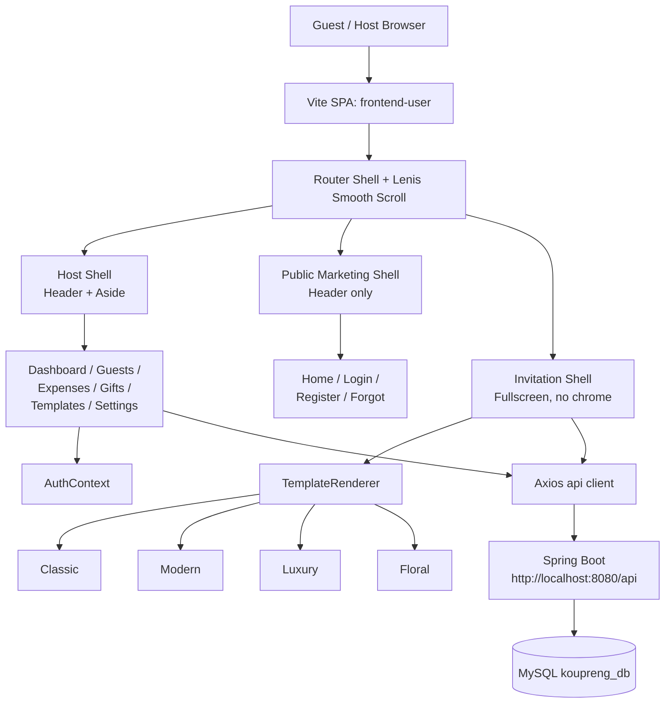
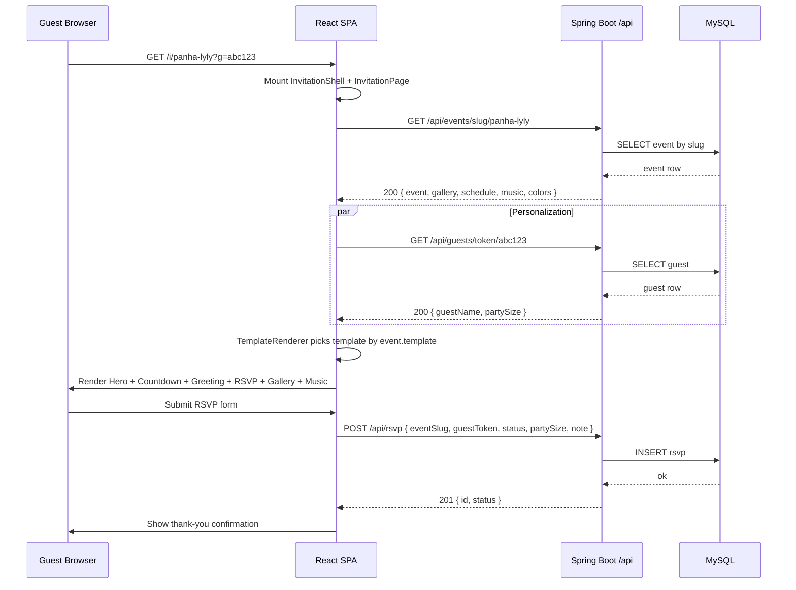

# Design Document: Wedding Invitation Experience

## Overview

This feature rebuilds `frontend-user` (React 19, Tailwind v4, Framer Motion, React Router v7, JSX only) into a modern, elegant wedding invitation web app. It serves two audiences from a single SPA: a **Host App** for couples who plan their wedding (auth, dashboard, guests, expenses, gifts, templates, settings) and a **Public Invitation App** which guests open via a slug URL (hero, countdown, RSVP, gallery, music, schedule, greeting).

The visual language matches the reference mocks in `frontend-user/public/example project/`: full-bleed photography, soft glassmorphism, generous whitespace, smooth scroll, and micro-interactions powered by Framer Motion. The work also cleans up the legacy `features/` vs `pages/` duplication, removes the duplicate `AuthContext`, consolidates two `services/` directories, deduplicates template folders, and moves all PNG assets out of feature folders into a single `src/assets/` tree.

API compatibility with the Spring Boot backend (`/api/**` on `http://localhost:8080`) is preserved. The frontend talks to the existing endpoints (`/api/auth/*`, `/api/users/me`, `/api/health`) over a single Axios instance with JWT bearer support, and adds forward-compatible service stubs for `/api/events/*`, `/api/guests/*`, and `/api/rsvp/*` that the backend will gain in a future task. CORS already permits `http://localhost:5173`.

## Architecture

### System Overview

The app is a single Vite-built SPA mounted at `/` with two logical sub-apps decided by route:

- **Host App** — authenticated routes under `/app/*` (dashboard, guests, expenses, gifts, templates, settings) and unauthenticated marketing/auth routes at `/`, `/login`, `/register`, `/forgot-password`.
- **Public Invitation App** — unauthenticated dynamic route at `/i/:slug` (and legacy `/invitation/:slug`) that renders a full-screen invitation experience for guests, optionally personalized via `?g=<guestId>`.



### Component Architecture: Host vs Public Invitation

The codebase is organized so the **public invitation** never imports anything from the **host app** (no auth context, no dashboard layout, no admin services). This keeps the guest bundle small and the public route always-renderable.

**Host App** (private, JWT required for `/app/*`):
- Layout: `<HostShell>` = `<Header />` + `<Aside />` + scrollable `<main>`.
- State: `AuthContext` (single source of truth) + per-feature hooks (`useEvents`, `useGuests`, etc.).
- Data: Authorized Axios instance attaches `Authorization: Bearer <token>`.

**Public Invitation App** (anonymous):
- Layout: `<InvitationShell>` = no header, no aside, `100dvh`, edge-to-edge.
- State: local component state + lightweight hooks (`useCountdown`, `useGuest`, `useMusic`, `useScroll`).
- Data: Unauthenticated Axios calls to `GET /api/events/slug/:slug` and `POST /api/rsvp` (the latter accepts a guest token from the URL).

### Routing Map

| Path                        | Shell             | Auth | Component                  |
| --------------------------- | ----------------- | ---- | -------------------------- |
| `/`                         | Marketing         | No   | `HomePage`                 |
| `/login`                    | Marketing         | No   | `LoginPage`                |
| `/register`                 | Marketing         | No   | `RegisterPage`             |
| `/forgot-password`          | Marketing         | No   | `ForgotPasswordPage`       |
| `/reset-password`           | Marketing         | No   | `ResetPasswordPage`        |
| `/app/dashboard`            | Host              | Yes  | `DashboardPage`            |
| `/app/events`               | Host              | Yes  | `EventsPage`               |
| `/app/events/new`           | Host              | Yes  | `CreateEventPage`          |
| `/app/guests`               | Host              | Yes  | `GuestsPage`               |
| `/app/expenses`             | Host              | Yes  | `ExpensesPage`             |
| `/app/gifts`                | Host              | Yes  | `WeddingGiftPage`          |
| `/app/templates`            | Host              | Yes  | `TemplatePage`             |
| `/app/templates/new`        | Host              | Yes  | `AddTemplatePage`          |
| `/app/settings`             | Host              | Yes  | `SettingsPage`             |
| `/i/:slug`                  | Invitation        | No   | `InvitationPage`           |
| `/invitation/:slug` (alias) | Invitation        | No   | `InvitationPage`           |
| `*`                         | Marketing         | No   | `NotFoundPage`             |

`<RequireAuth>` wraps the `/app/*` group and redirects to `/login?next=<path>` when no JWT is present.

### Sequence Diagram: Public Invitation Open



### Sequence Diagram: Host Login + Dashboard Load

```mermaid
sequenceDiagram
    participant Host as Host Browser
    participant SPA as React SPA
    participant Auth as AuthContext
    participant API as Spring Boot /api

    Host->>SPA: POST /login (form)
    SPA->>API: POST /api/auth/login { email, password }
    API-->>SPA: 200 { accessToken, user }
    SPA->>Auth: setUser(user); persist token
    Auth-->>SPA: state updated
    SPA->>Host: navigate /app/dashboard
    SPA->>API: GET /api/users/me (Authorization: Bearer)
    API-->>SPA: 200 { profile }
    SPA->>API: GET /api/events
    API-->>SPA: 200 [event,...]
    SPA->>Host: render Dashboard cards
```

### State Management

State is intentionally local-first. There is no Redux/Zustand store; React 19 primitives plus three small contexts cover everything.

- **`AuthContext`** (`src/app/auth/AuthContext.jsx`) — `{ user, token, status, login, logout, refresh }`. Token persisted in `localStorage` under `koupreng.token`. Hydrates on app boot via `GET /api/users/me`.
- **`ThemeContext`** (`src/app/theme/ThemeContext.jsx`) — `{ mode: 'light' | 'dark', toggle }`. Default `light`. Persisted in `localStorage` under `koupreng.theme`. Applies `data-theme` attribute on `<html>`.
- **`InvitationDataContext`** (`src/invitation/InvitationDataContext.jsx`) — provides the loaded `event`, `guest`, and `colors` to every section so individual sections do not re-fetch.
- Per-feature hooks (`useEvents`, `useGuests`, `useExpenses`, `useGifts`) own their own loading/error/data state and expose imperative actions.

### API Integration

A single Axios instance lives in `src/shared/api/client.js`. Everything else is a thin module of typed call helpers.

Key behaviors:

- `baseURL` resolves from `import.meta.env.VITE_API_URL` (defaults to `http://localhost:8080/api`, matching the backend `server.port=8080` and CORS allow-list).
- Request interceptor attaches `Authorization: Bearer <token>` when `koupreng.token` is set.
- Response interceptor: on `401` for an authed request, clears the token and dispatches a `auth:expired` window event the `AuthContext` listens for (forces logout + redirect to `/login`).
- Public invitation calls bypass the token attachment by setting `config.public = true`.

Existing endpoints used today (verified in `backend/src/main/java/.../auth/AuthController.java` and `UserController.java`):

| Method | Path                          | Notes                              |
| ------ | ----------------------------- | ---------------------------------- |
| POST   | `/api/auth/register`          | public                             |
| POST   | `/api/auth/login`             | public, returns `{ accessToken }`  |
| POST   | `/api/auth/logout`            | authed                             |
| POST   | `/api/auth/forgot-password`   | public                             |
| POST   | `/api/auth/reset-password`    | public                             |
| GET    | `/api/users/me`               | authed                             |
| POST   | `/api/users/me/change-password` | authed                           |
| GET    | `/api/health`                 | public                             |

Forward-compatible service stubs added now (call paths the backend will implement next):

| Method | Path                                | Used by                 |
| ------ | ----------------------------------- | ----------------------- |
| GET    | `/api/events`                       | Host dashboard, events  |
| GET    | `/api/events/:id`                   | Host edit               |
| GET    | `/api/events/slug/:slug`            | Public invitation       |
| POST   | `/api/events`                       | Host create             |
| PUT    | `/api/events/:id`                   | Host update             |
| DELETE | `/api/events/:id`                   | Host delete             |
| POST   | `/api/events/:id/upload`            | Image upload            |
| POST   | `/api/events/:id/music`             | Music upload            |
| GET    | `/api/guests`                       | Host guests             |
| GET    | `/api/guests/token/:token`          | Public personalization  |
| POST   | `/api/rsvp`                         | Public RSVP submission  |

Until those endpoints exist, service modules return shaped mock data behind a `MOCK = true` flag so the UI is fully buildable.

### Design Tokens & Theming

Tokens live in `src/index.css` under `:root` (light) and `:root[data-theme="dark"]` (dark) so they are available everywhere — Tailwind v4 utilities, plain CSS, and inline styles. The wedding palette is intentionally warm and editorial.

```css
:root {
  /* Brand */
  --color-primary: #7033ff;
  --color-primary-foreground: #ffffff;
  --color-accent: #c9a84c;          /* champagne gold */
  --color-accent-foreground: #1a1a2e;

  /* Surfaces */
  --color-bg: #fdfcff;
  --color-surface: #ffffff;
  --color-surface-elevated: rgba(255,255,255,0.72); /* glass */
  --color-border: #e7e7ee;

  /* Text */
  --color-text: #1a1a2e;
  --color-text-muted: #6b7280;

  /* Romantic (invitation only) */
  --color-rose: #f5d6dc;
  --color-rose-deep: #b87a85;
  --color-cream: #faf3e7;

  /* Typography */
  --font-display: 'Cormorant Garamond', 'Noto Serif Khmer', serif;
  --font-body: 'DM Sans', 'Noto Sans Khmer', sans-serif;
  --font-script: 'Great Vibes', cursive;

  /* Motion */
  --ease-romantic: cubic-bezier(0.22, 1, 0.36, 1);
  --duration-fast: 220ms;
  --duration-base: 420ms;
  --duration-slow: 720ms;

  /* Shape */
  --radius-sm: 8px;
  --radius-md: 14px;
  --radius-lg: 22px;
  --radius-pill: 999px;

  /* Glass */
  --glass-blur: 14px;
  --glass-bg: rgba(255,255,255,0.55);
  --glass-border: rgba(255,255,255,0.35);
  --glass-shadow: 0 8px 32px rgba(31,38,135,0.12);
}
```

A `.glass` utility class is added to `index.css` (`backdrop-filter: blur(var(--glass-blur))`, `background: var(--glass-bg)`, `border: 1px solid var(--glass-border)`) for reuse on chips, cards, and the music player.

## Components and Interfaces

### Host App Components

#### Component: HostShell

**Purpose**: Authenticated chrome (header + collapsible aside + main scroll container).

**Interface**:
```jsx
interface HostShellProps {
  children: ReactNode  // route element
}

<HostShell>
  <Outlet />
</HostShell>
```

**Responsibilities**:
- Render `<Header />` and `<Aside />`
- Show a route-level `<PageTransition>` wrapper
- Provide a `<Toaster />` slot for non-blocking feedback

#### Component: RequireAuth

**Purpose**: Route guard for `/app/*`.

**Interface**:
```jsx
<Route element={<RequireAuth />}>
  <Route path="/app/dashboard" element={<DashboardPage />} />
</Route>
```

**Responsibilities**:
- Read `AuthContext.status`
- While `status === 'loading'`, render a centered spinner
- If `status === 'unauthenticated'`, `<Navigate to="/login?next=...">`
- Else `<Outlet />`

### Public Invitation Components

#### Component: InvitationPage

**Purpose**: Top-level orchestrator that fetches event by slug and dispatches to a template.

**Interface**:
```jsx
interface InvitationPageProps {}  // route component, reads :slug from useParams

<Route path="/i/:slug" element={<InvitationPage />} />
```

**Responsibilities**:
- `useEvent(slug)` to fetch event data
- `useGuest(searchParams.get('g'))` to fetch optional guest personalization
- Render `<TemplateRenderer event={event} guest={guest} />`
- Handle loading, not-found, and error states with branded fallbacks

#### Component: TemplateRenderer

**Purpose**: Picks the right template by `event.template` and renders it inside an `<InvitationDataContext.Provider>`.

**Interface**:
```jsx
interface TemplateRendererProps {
  event: EventModel
  guest?: GuestModel | null
}
```

**Responsibilities**:
- Lazy-load template module by key (`classic | modern | luxury | floral`)
- Fall back to `classic` when key is unknown
- Apply `event.colors` to CSS variables scoped under `[data-template-root]`

#### Component: Hero

**Purpose**: Full-bleed cinematic opening with couple names, date, scroll cue.

**Interface**:
```jsx
interface HeroProps {
  groomName: string
  brideName: string
  date: string          // ISO date
  coverImage: string    // URL
  onScrollCue?: () => void
}
```

**Responsibilities**:
- Render `100dvh` photo with gradient overlay
- Animate names in with `motion` (display font, staggered)
- Show a tap/scroll cue that smooth-scrolls to next section

#### Component: Countdown

**Purpose**: Live ticking countdown to the wedding date.

**Interface**:
```jsx
interface CountdownProps {
  targetDate: string    // ISO date with time
  label?: string        // optional headline
}
```

**Responsibilities**:
- Use `useCountdown(targetDate)` to get `{ days, hours, minutes, seconds, isPast }`
- Render four glass cards with monospace numerals
- When `isPast === true`, render a celebratory "We're married!" message

#### Component: GuestGreeting

**Purpose**: Personalized welcome when `?g=<token>` resolves to a guest.

**Interface**:
```jsx
interface GuestGreetingProps {
  guest: GuestModel | null
  fallbackName?: string
}
```

**Responsibilities**:
- Render `Dear {guest.name}` in script font with gentle entrance
- Hide entirely when no guest is provided

#### Component: RSVPForm

**Purpose**: Capture guest response.

**Interface**:
```jsx
interface RSVPFormProps {
  eventSlug: string
  guestToken?: string
  maxParty?: number    // default 4
  onSuccess?: (rsvp) => void
}
```

**Responsibilities**:
- Use `react-hook-form` for validated state
- Fields: `attending` (radio: yes/no), `partySize` (1..maxParty, only when yes), `dietary` (textarea, optional), `note` (textarea, optional)
- Submit via `rsvpService.submit(...)`
- Show inline success state, disable double-submit

#### Component: Gallery

**Purpose**: Photo gallery with lightbox.

**Interface**:
```jsx
interface GalleryProps {
  images: GalleryImage[]   // [{ src, alt, w, h }, ...]
}
```

**Responsibilities**:
- Render a Swiper-powered slider (autoplay, loop) and a tap-to-zoom lightbox
- Lazy-load images, use `loading="lazy"` and `decoding="async"`

#### Component: MusicPlayer

**Purpose**: Floating, dismissible background music control.

**Interface**:
```jsx
interface MusicPlayerProps {
  src: string
  defaultMuted?: boolean   // default true (autoplay policy)
  title?: string
}
```

**Responsibilities**:
- Render a glass pill in the bottom-right with a play/pause icon
- Persist user preference in `sessionStorage` under `koupreng.invitation.music`
- Respect "reduced motion / autoplay denied": never auto-play with sound until user gesture

#### Component: ScheduleSection

**Purpose**: Show ceremony / reception schedule.

**Interface**:
```jsx
interface ScheduleSectionProps {
  schedule: ScheduleItem[]   // [{ time, event, location? }]
}
```

#### Component: LocationMap

**Purpose**: Static map preview + open-in-maps link.

**Interface**:
```jsx
interface LocationMapProps {
  location: string
  lat?: number
  lng?: number
}
```

### Shared UI

| Component         | Purpose                                                         |
| ----------------- | --------------------------------------------------------------- |
| `Button`          | Primary / ghost / outline variants, motion-aware                |
| `GlassCard`       | Wrapper applying glassmorphism tokens                           |
| `PageTransition`  | Framer Motion fade+slide on route change                        |
| `ScrollReveal`    | `useInView` wrapper with `fadeUp` variants                      |
| `SectionHeading`  | Display-font heading + optional eyebrow + divider               |
| `Spinner`         | Centered loader                                                 |
| `Toaster`         | Lightweight toast system for RSVP success / errors              |

## Data Models

### EventModel

```jsx
interface EventModel {
  id: string
  slug: string                    // /i/:slug
  template: 'classic' | 'modern' | 'luxury' | 'floral'
  groomName: string
  brideName: string
  date: string                    // ISO date+time, e.g. '2026-05-10T14:00:00+07:00'
  location: string
  story?: string
  coverImage?: string             // URL
  gallery: GalleryImage[]
  music?: string                  // URL
  schedule: ScheduleItem[]
  colors: {
    primary: string               // hex
    accent: string                // hex
  }
}
```

**Validation Rules**:
- `slug` matches `/^[a-z0-9-]{3,80}$/`
- `template` must be one of the four known keys; default `classic` on unknown
- `date` parses to a valid `Date`
- `colors.primary` and `colors.accent` are 6- or 8-digit hex
- `gallery.length <= 60`, `schedule.length <= 20`

### GuestModel

```jsx
interface GuestModel {
  id: string
  token: string                   // opaque, unguessable
  name: string
  partyMaxSize: number            // upper bound for RSVP party
  status: 'pending' | 'confirmed' | 'declined'
}
```

**Validation Rules**:
- `name` length 1..120
- `partyMaxSize` integer 1..10

### RsvpModel

```jsx
interface RsvpModel {
  eventSlug: string
  guestToken?: string
  attending: boolean
  partySize: number               // 1 if attending=false (ignored)
  dietary?: string
  note?: string
}
```

**Validation Rules**:
- When `attending === true`, `partySize >= 1 && partySize <= guest.partyMaxSize` (or `<= 4` if anonymous)
- `dietary` and `note` length `<= 500` each
- Idempotent by `(eventSlug, guestToken)` on the server

### GalleryImage

```jsx
interface GalleryImage {
  src: string
  alt: string
  w?: number
  h?: number
}
```

### ScheduleItem

```jsx
interface ScheduleItem {
  time: string         // 'HH:mm' or ISO
  event: string
  location?: string
}
```

## Algorithmic Pseudocode

### Algorithm: Countdown Calculation

```pascal
ALGORITHM computeCountdown(targetISO, nowMs)
INPUT:
  targetISO: ISO 8601 string for the target moment
  nowMs:     current epoch milliseconds
OUTPUT:
  { days, hours, minutes, seconds, isPast }

BEGIN
  ASSERT targetISO is parseable
  targetMs ← parseISOToMs(targetISO)
  diffMs   ← targetMs - nowMs

  IF diffMs <= 0 THEN
    RETURN { days: 0, hours: 0, minutes: 0, seconds: 0, isPast: true }
  END IF

  totalSeconds ← floor(diffMs / 1000)
  days         ← floor(totalSeconds / 86400)
  hours        ← floor((totalSeconds mod 86400) / 3600)
  minutes      ← floor((totalSeconds mod 3600) / 60)
  seconds      ← totalSeconds mod 60

  ASSERT days >= 0
  ASSERT 0 <= hours   < 24
  ASSERT 0 <= minutes < 60
  ASSERT 0 <= seconds < 60

  RETURN { days, hours, minutes, seconds, isPast: false }
END
```

**Preconditions**:
- `targetISO` parses to a finite number
- `nowMs` is a non-negative integer

**Postconditions**:
- Return shape always has the five fields
- All numeric fields are non-negative integers
- `isPast === true` iff `targetMs <= nowMs`

**Loop Invariants**: N/A (pure function, no loop)

### Algorithm: RSVP Submission

```pascal
ALGORITHM submitRSVP(form, eventSlug, guestToken)
INPUT:
  form:        { attending, partySize, dietary, note }
  eventSlug:   string
  guestToken:  optional string
OUTPUT:
  Result(rsvp) | Error(message)

BEGIN
  ASSERT eventSlug matches /^[a-z0-9-]{3,80}$/

  // Step 1: Local validation
  IF form.attending = true THEN
    IF NOT (form.partySize >= 1 AND form.partySize <= 10) THEN
      RETURN Error("Invalid party size")
    END IF
  ELSE
    form.partySize ← 1
  END IF

  IF length(form.dietary) > 500 OR length(form.note) > 500 THEN
    RETURN Error("Notes must be 500 characters or fewer")
  END IF

  // Step 2: Build payload
  payload ← {
    eventSlug:  eventSlug,
    guestToken: guestToken,
    attending:  form.attending,
    partySize:  form.partySize,
    dietary:    form.dietary,
    note:       form.note
  }

  // Step 3: POST
  TRY
    response ← api.post("/rsvp", payload, { public: true })
    ASSERT response.status IN { 200, 201 }
    RETURN Result(response.data)
  CATCH err
    IF err.status = 409 THEN
      RETURN Error("You have already responded")
    END IF
    RETURN Error(err.message OR "Could not submit RSVP")
  END TRY
END
```

**Preconditions**:
- `form` is the validated react-hook-form output
- `api` is the configured Axios instance

**Postconditions**:
- Either returns a Result with a server-side `rsvp.id`, or an Error with a user-facing message
- No partial writes (server enforces idempotency)

**Loop Invariants**: N/A

### Algorithm: Music Player Toggle

```pascal
ALGORITHM toggleMusic(state, audioEl, userInitiated)
INPUT:
  state:         { isPlaying, isMuted }
  audioEl:       HTMLAudioElement
  userInitiated: boolean
OUTPUT:
  newState

BEGIN
  IF state.isPlaying = true THEN
    audioEl.pause()
    persist("koupreng.invitation.music", "paused")
    RETURN { isPlaying: false, isMuted: state.isMuted }
  END IF

  // Browser autoplay policy: only unmute on a real user gesture
  IF userInitiated = true THEN
    audioEl.muted ← false
  ELSE
    audioEl.muted ← true
  END IF

  TRY
    audioEl.play()                     // returns a promise
    persist("koupreng.invitation.music", "playing")
    RETURN { isPlaying: true, isMuted: audioEl.muted }
  CATCH err
    // Autoplay rejected — surface a manual play affordance
    RETURN { isPlaying: false, isMuted: true }
  END TRY
END
```

**Preconditions**:
- `audioEl` is mounted and has a valid `src`

**Postconditions**:
- The component reflects the actual `audioEl.paused` after the call
- `localStorage`/`sessionStorage` is updated to match the visible state
- Sound never plays without a user gesture

**Loop Invariants**: N/A

### Algorithm: Smooth Scroll To Section

```pascal
ALGORITHM scrollToSection(sectionId, lenisInstance)
INPUT:
  sectionId:     DOM id, e.g. "rsvp"
  lenisInstance: active Lenis instance or null
OUTPUT:
  void

BEGIN
  el ← document.getElementById(sectionId)
  IF el = null THEN RETURN

  IF lenisInstance ≠ null THEN
    lenisInstance.scrollTo(el, { offset: -24, duration: 1.1 })
  ELSE
    el.scrollIntoView({ behavior: "smooth", block: "start" })
  END IF
END
```

**Preconditions**:
- `sectionId` corresponds to a section rendered in the current route

**Postconditions**:
- Viewport is scrolled near the top of the section, or no-ops when missing

**Loop Invariants**: N/A

### Algorithm: Template Selection

```pascal
ALGORITHM pickTemplate(eventTemplateKey)
INPUT:
  eventTemplateKey: string
OUTPUT:
  TemplateComponent

BEGIN
  registry ← {
    "classic": ClassicTemplate,
    "modern":  ModernTemplate,
    "luxury":  LuxuryTemplate,
    "floral":  FloralTemplate
  }

  IF eventTemplateKey ∈ keys(registry) THEN
    RETURN registry[eventTemplateKey]
  ELSE
    RETURN ClassicTemplate           // safe default
  END IF
END
```

**Preconditions**: All four templates resolve at runtime via `lazy(() => import(...))`.

**Postconditions**: Always returns a renderable component.

## Key Functions with Formal Specifications

### useCountdown

```jsx
function useCountdown(targetISO: string): {
  days: number, hours: number, minutes: number, seconds: number, isPast: boolean
}
```

**Preconditions**:
- `targetISO` is a non-empty string parseable by `Date`

**Postconditions**:
- Returns the `computeCountdown` result for "now" on every render
- Internally schedules a `setInterval(1000)` that re-renders every second
- Cleans up the interval when unmounted or when `targetISO` changes
- Returns `{ days: 0, hours: 0, minutes: 0, seconds: 0, isPast: true }` once the date has passed and stops updating

**Loop Invariants**:
- Between two consecutive ticks, the integer fields decrease monotonically (or hold zero) until `isPast` flips to `true`

### useGuest

```jsx
function useGuest(token: string | null): {
  guest: GuestModel | null, status: 'idle'|'loading'|'ready'|'error'
}
```

**Preconditions**:
- `token`, when provided, is the URL `?g=` value

**Postconditions**:
- When `token === null`, returns `{ guest: null, status: 'idle' }`
- Otherwise, fires a single `GET /api/guests/token/:token` and resolves to `ready` or `error`
- Never throws into the React tree; errors set `status: 'error'`

### useMusic

```jsx
function useMusic(src: string, options?: { defaultMuted?: boolean }): {
  isPlaying: boolean, isMuted: boolean, toggle: () => void, mute: () => void
}
```

**Preconditions**:
- `src` is a non-empty URL or empty string (in which case the hook is a no-op)

**Postconditions**:
- The audio element follows the browser autoplay policy (no sound without gesture)
- `toggle()` is idempotent within one tick (debounced)
- Persists last user choice in `sessionStorage`

### useScroll

```jsx
function useScroll(): {
  scrollTo: (id: string) => void,
  progress: number   // 0..1 of document scroll
}
```

**Postconditions**:
- `progress` is clamped to `[0, 1]`
- `scrollTo` cooperates with Lenis when present, falls back to native smooth scroll

### rsvpService.submit

```jsx
function rsvpService.submit(payload: RsvpModel): Promise<RsvpModel>
```

**Preconditions**:
- `payload` passes client-side validation

**Postconditions**:
- Resolves with the server's stored RSVP on success
- Rejects with a typed `ApiError` on failure (`{ code, message, status }`)
- Never sends an `Authorization` header (public endpoint)

## Example Usage

```jsx
// Public invitation entry point
function InvitationPage() {
  const { slug } = useParams();
  const [params] = useSearchParams();
  const guestToken = params.get("g");

  const { event, status: eventStatus } = useEvent(slug);
  const { guest } = useGuest(guestToken);

  if (eventStatus === "loading") return <Spinner />;
  if (eventStatus === "error" || !event) return <NotFoundInvitation />;

  return (
    <InvitationDataContext.Provider value={{ event, guest }}>
      <TemplateRenderer event={event} guest={guest} />
    </InvitationDataContext.Provider>
  );
}

// Inside a template
function LuxuryTemplate({ data }) {
  const { guest } = useInvitationData();
  return (
    <main data-template-root className="invitation-luxury">
      <Hero
        groomName={data.groomName}
        brideName={data.brideName}
        date={data.date}
        coverImage={data.coverImage}
      />
      <GuestGreeting guest={guest} />
      <Countdown targetDate={data.date} />
      <ScheduleSection schedule={data.schedule} />
      <Gallery images={data.gallery} />
      <RSVPForm eventSlug={data.slug} guestToken={guest?.token} />
      {data.music && <MusicPlayer src={data.music} />}
    </main>
  );
}

// Hook usage
const { days, hours, minutes, seconds, isPast } = useCountdown(event.date);
```

## Framer Motion Patterns

A small set of reusable variants in `src/shared/motion/variants.js`:

```jsx
export const fadeUp = {
  hidden:  { opacity: 0, y: 32 },
  visible: { opacity: 1, y: 0,
             transition: { duration: 0.62, ease: [0.22, 1, 0.36, 1] } }
};

export const stagger = (gap = 0.08) => ({
  hidden:  {},
  visible: { transition: { staggerChildren: gap } }
});

export const heroNames = {
  hidden:  { opacity: 0, letterSpacing: "0.4em", y: 24 },
  visible: { opacity: 1, letterSpacing: "0.12em", y: 0,
             transition: { duration: 1.1, ease: [0.22, 1, 0.36, 1] } }
};

export const scrollCue = {
  animate: { y: [0, 10, 0],
             transition: { duration: 1.6, repeat: Infinity, ease: "easeInOut" } }
};
```

Conventions:
- Section-level reveals use `<motion.section variants={stagger()} initial="hidden" whileInView="visible" viewport={{ once: true, amount: 0.2 }}>`.
- Page transitions go through the existing `<PageTransition>` wrapper.
- Interactive elements use `whileHover={{ scale: 1.03 }}` + `whileTap={{ scale: 0.97 }}` with a spring transition.
- Honor `prefers-reduced-motion`: at `App` boot, if the media query matches, override variants to `{ duration: 0 }` via a `MotionConfig` reducer.

## Target Folder Structure

```
frontend-user/
├─ public/
│  └─ example project/                 # reference mocks (kept as-is, not bundled)
├─ src/
│  ├─ main.jsx
│  ├─ App.jsx
│  ├─ index.css                        # tokens + globals
│  ├─ assets/
│  │  ├─ fonts/
│  │  │  └─ fonts.css
│  │  └─ images/
│  │     ├─ hero/
│  │     ├─ patterns/
│  │     └─ icons/                     # icon-1.png, icon-2-2.png, ...
│  ├─ app/
│  │  ├─ router.jsx                    # all routes, nested guards
│  │  ├─ auth/
│  │  │  ├─ AuthContext.jsx
│  │  │  ├─ RequireAuth.jsx
│  │  │  └─ useAuth.js
│  │  └─ theme/
│  │     ├─ ThemeContext.jsx
│  │     └─ useTheme.js
│  ├─ shared/
│  │  ├─ api/
│  │  │  ├─ client.js                  # single Axios instance
│  │  │  └─ errors.js                  # ApiError, parse helper
│  │  ├─ services/
│  │  │  ├─ authService.js
│  │  │  ├─ userService.js
│  │  │  ├─ eventService.js
│  │  │  ├─ guestService.js
│  │  │  └─ rsvpService.js
│  │  ├─ hooks/
│  │  │  ├─ useCountdown.js
│  │  │  ├─ useScroll.js
│  │  │  ├─ useGuest.js
│  │  │  ├─ useMusic.js
│  │  │  ├─ useLenis.js
│  │  │  ├─ useToggle.js
│  │  │  └─ useImageSlider.js
│  │  ├─ motion/
│  │  │  └─ variants.js
│  │  ├─ ui/
│  │  │  ├─ Button.jsx
│  │  │  ├─ GlassCard.jsx
│  │  │  ├─ Spinner.jsx
│  │  │  ├─ PageTransition.jsx
│  │  │  ├─ ScrollReveal.jsx
│  │  │  ├─ SectionHeading.jsx
│  │  │  └─ Toaster.jsx
│  │  └─ layout/
│  │     ├─ HostShell.jsx
│  │     ├─ Header.jsx
│  │     └─ Aside.jsx
│  ├─ pages/
│  │  ├─ marketing/
│  │  │  ├─ HomePage.jsx
│  │  │  └─ NotFoundPage.jsx
│  │  ├─ auth/
│  │  │  ├─ LoginPage.jsx
│  │  │  ├─ RegisterPage.jsx
│  │  │  ├─ ForgotPasswordPage.jsx
│  │  │  └─ ResetPasswordPage.jsx
│  │  └─ host/
│  │     ├─ DashboardPage.jsx
│  │     ├─ EventsPage.jsx
│  │     ├─ CreateEventPage.jsx
│  │     ├─ GuestsPage.jsx
│  │     ├─ ExpensesPage.jsx
│  │     ├─ WeddingGiftPage.jsx
│  │     ├─ TemplatePage.jsx
│  │     ├─ AddTemplatePage.jsx
│  │     └─ SettingsPage.jsx
│  └─ invitation/
│     ├─ InvitationPage.jsx
│     ├─ InvitationDataContext.jsx
│     ├─ TemplateRenderer.jsx
│     ├─ sections/
│     │  ├─ Hero.jsx
│     │  ├─ Countdown.jsx
│     │  ├─ GuestGreeting.jsx
│     │  ├─ ScheduleSection.jsx
│     │  ├─ Gallery.jsx
│     │  ├─ MusicPlayer.jsx
│     │  ├─ LocationMap.jsx
│     │  └─ RSVPForm.jsx
│     └─ templates/
│        ├─ Classic/ClassicTemplate.jsx
│        ├─ Modern/ModernTemplate.jsx
│        ├─ Luxury/LuxuryTemplate.jsx
│        └─ Floral/FloralTemplate.jsx
├─ tailwind.config.js
├─ vite.config.js
└─ package.json
```

## File Migration List

### Delete (duplicates / dead code)

| Path                                            | Reason                                                            |
| ----------------------------------------------- | ----------------------------------------------------------------- |
| `src/context/AuthContext.jsx`                   | Duplicate of `src/shared/AuthContext.jsx`; not used by any import |
| `src/context/read.md`                           | Empty placeholder doc                                             |
| `src/services/api.js`                           | Duplicate of `src/shared/services/api.js`                         |
| `src/services/read.md`                          | Empty placeholder doc                                             |
| `src/features/AddTemplate/`                     | Superseded by `src/pages/Dashboard/AddTemplatePage.jsx`           |
| `src/features/Dashboard/`                       | Superseded by `src/pages/Dashboard/DashboardPage.jsx`             |
| `src/features/Events/`                          | Superseded by `src/pages/Events/*`                                |
| `src/features/Expenses/`                        | Superseded by `src/pages/Dashboard/ExpensesPage.jsx`              |
| `src/features/Guests/`                          | Superseded by `src/pages/Dashboard/GuestsPage.jsx`                |
| `src/features/Template/`                        | Superseded by `src/pages/Dashboard/TemplatePage.jsx`              |
| `src/features/WeddingGift/`                     | Superseded by `src/pages/Dashboard/WeddingGiftPage.jsx`           |
| `src/features/read.md`                          | Empty placeholder doc                                             |
| `src/features/AddTemplate/AddTemplate.png`      | Co-located asset; reference image lives in `public/example project/` |
| `src/features/Dashboard/dashborad.png`          | Co-located asset; same as above                                   |
| `src/features/Events/create_even.png`           | Co-located asset; same as above                                   |
| `src/features/Expenses/ExpensesPage.png`        | Co-located asset; same as above                                   |
| `src/features/Guests/GuestsPage.png`            | Co-located asset; same as above                                   |
| `src/features/WeddingGift/WeddingGift.png`      | Co-located asset; same as above                                   |
| `src/templates/`                                | Empty stub folder — invitation templates live under `src/invitation/templates/` |
| `src/utils/read.md`                             | Empty placeholder doc                                             |
| `src/shared/utils/`                             | Empty folder                                                      |
| `src/invitation/components/`                    | Empty stub                                                        |
| `src/invitation/sections/` (current empty dir)  | Re-created with real files in target structure                    |
| `src/assets/style/output.css`                   | Generated artifact; Tailwind v4 + Vite plugin handles styles      |
| `src/assets/style/input.css`                    | Replaced by `index.css` + Tailwind v4 directives                  |
| `src/shared/read.md`                            | Empty placeholder doc                                             |
| `src/shared/services/read.md`                   | Empty placeholder doc                                             |
| `src/features/Template/read.md`                 | Empty placeholder doc                                             |

### Keep (move/rename only)

| From                                                | To                                                  | Notes                                  |
| --------------------------------------------------- | --------------------------------------------------- | -------------------------------------- |
| `src/shared/AuthContext.jsx`                        | `src/app/auth/AuthContext.jsx`                      | Single source of truth; add real login/logout via authService |
| `src/shared/services/api.js`                        | `src/shared/api/client.js`                          | Adds interceptors                      |
| `src/shared/services/authService.js`                | `src/shared/services/authService.js`                | Updated to use new client              |
| `src/shared/services/eventService.js`               | `src/shared/services/eventService.js`               | Same                                   |
| `src/shared/hooks/useLenis.js`                      | `src/shared/hooks/useLenis.js`                      | Unchanged                              |
| `src/shared/hooks/useToggle.js`                     | `src/shared/hooks/useToggle.js`                     | Unchanged                              |
| `src/shared/hooks/useImageSlider.js`                | `src/shared/hooks/useImageSlider.js`                | Unchanged                              |
| `src/shared/hooks/useEvents.js`                     | `src/shared/hooks/useEvents.js`                     | Switch import to new client            |
| `src/shared/hooks/useDashboardData.js`              | `src/shared/hooks/useDashboardData.js`              | Unchanged                              |
| `src/shared/hooks/useHeroAnimation.js`              | DELETE → replaced by Framer Motion variants         | animejs no longer needed (see deps)    |
| `src/shared/ui/PageTransition.jsx`                  | `src/shared/ui/PageTransition.jsx`                  | Unchanged                              |
| `src/shared/ui/AnimatedButton.jsx`                  | `src/shared/ui/Button.jsx`                          | Renamed; refactored                    |
| `src/shared/ui/MagicCard.jsx`                       | `src/shared/ui/GlassCard.jsx`                       | Renamed; uses tokens                   |
| `src/shared/ui/ScrollReveal.jsx`                    | `src/shared/ui/ScrollReveal.jsx`                    | Unchanged                              |
| `src/shared/ui/TimePicker.jsx` + `.css`             | `src/shared/ui/TimePicker.jsx` + `TimePicker.css`   | Kept for host event creation           |
| `src/shared/layout/Header.jsx` + `.css`             | `src/shared/layout/Header.jsx` + `Header.css`       | Kept                                   |
| `src/shared/layout/Aside.jsx` + `.css`              | `src/shared/layout/Aside.jsx` + `Aside.css`         | Kept                                   |
| `src/pages/Home/HomePage.jsx` + `.css`              | `src/pages/marketing/HomePage.jsx`                  | Move; CSS may stay alongside or migrate to Tailwind utilities |
| `src/pages/Auth/LoginPage.jsx` + `RegisterPage.jsx` + `ForgotPassword.jsx` + `AuthPage.css` | `src/pages/auth/{LoginPage,RegisterPage,ForgotPasswordPage,ResetPasswordPage}.jsx` | Wire to authService |
| `src/pages/Dashboard/*Page.jsx`                     | `src/pages/host/*Page.jsx`                          | Move + update imports                  |
| `src/pages/Events/*Page.jsx`                        | `src/pages/host/{EventsPage,CreateEventPage}.jsx`   | Move                                   |
| `src/invitation/TemplateRenderer.jsx`               | `src/invitation/TemplateRenderer.jsx`               | Wraps in InvitationDataContext         |
| `src/invitation/pages/InvitationPage.jsx`           | `src/invitation/InvitationPage.jsx`                 | Lift one level; replace mock with real fetch |
| `src/invitation/templates/Classic/ClassicTemplate.jsx` | same path                                        | Refactor to compose new sections       |
| `src/invitation/templates/Modern/ModernTemplate.jsx` | same path                                          | Refactor                                |
| `src/invitation/templates/Luxury/LuxuryTemplate.jsx` | same path                                          | Refactor                                |
| `src/invitation/templates/Floral/FloralTemplate.jsx` | same path                                          | Refactor                                |
| `src/assets/fonts/fonts.css`                        | `src/assets/fonts/fonts.css`                        | Add display + script font faces        |
| `src/assets/icons/*.png`                            | `src/assets/images/icons/*.png`                     | Move out of `icons/` (these are wedding decoratives, not glyphs) |

### Create (new files)

| Path                                                | Purpose                                              |
| --------------------------------------------------- | ---------------------------------------------------- |
| `src/app/router.jsx`                                | Centralized routes + guards                          |
| `src/app/auth/RequireAuth.jsx`                      | Route guard                                          |
| `src/app/auth/useAuth.js`                           | Hook reading AuthContext                             |
| `src/app/theme/ThemeContext.jsx`                    | Light/dark theme                                     |
| `src/app/theme/useTheme.js`                         | Hook                                                 |
| `src/shared/api/client.js`                          | Axios + interceptors                                 |
| `src/shared/api/errors.js`                          | `ApiError` class                                     |
| `src/shared/services/userService.js`                | `/api/users/me`                                      |
| `src/shared/services/guestService.js`               | `/api/guests/*`                                      |
| `src/shared/services/rsvpService.js`                | `/api/rsvp`                                          |
| `src/shared/hooks/useCountdown.js`                  | Countdown                                            |
| `src/shared/hooks/useScroll.js`                     | Scroll progress + scrollTo                           |
| `src/shared/hooks/useGuest.js`                      | Guest fetch                                          |
| `src/shared/hooks/useMusic.js`                      | Music control                                        |
| `src/shared/motion/variants.js`                     | Reusable Framer Motion variants                      |
| `src/shared/ui/SectionHeading.jsx`                  | Display heading                                      |
| `src/shared/ui/Spinner.jsx`                         | Loader                                               |
| `src/shared/ui/Toaster.jsx`                         | Toast system                                         |
| `src/shared/ui/GlassCard.jsx`                       | Glass wrapper (renamed MagicCard)                    |
| `src/shared/ui/Button.jsx`                          | Button (renamed AnimatedButton)                      |
| `src/shared/layout/HostShell.jsx`                   | Aside + Header + main wrapper                        |
| `src/pages/marketing/NotFoundPage.jsx`              | 404                                                  |
| `src/pages/auth/ResetPasswordPage.jsx`              | Reset flow                                           |
| `src/pages/host/SettingsPage.jsx`                   | Settings (already in pages/Dashboard, move)          |
| `src/invitation/InvitationDataContext.jsx`          | Provides event + guest                               |
| `src/invitation/sections/Hero.jsx`                  | New                                                  |
| `src/invitation/sections/Countdown.jsx`             | New                                                  |
| `src/invitation/sections/GuestGreeting.jsx`         | New                                                  |
| `src/invitation/sections/ScheduleSection.jsx`       | New                                                  |
| `src/invitation/sections/Gallery.jsx`               | New                                                  |
| `src/invitation/sections/MusicPlayer.jsx`           | New                                                  |
| `src/invitation/sections/LocationMap.jsx`           | New                                                  |
| `src/invitation/sections/RSVPForm.jsx`              | New                                                  |

### Migration Plan (phased)

1. **Phase 0 — Safety net**: ensure `npm run lint` and `npm run build` are green on the current main, capture a baseline.
2. **Phase 1 — Cleanup**: delete the duplicates (`src/context/*`, `src/services/*`, `src/features/*`, `src/templates/`, empty `read.md` files), commit. Build still passes because nothing imports them.
3. **Phase 2 — Tokens & shell**: add design tokens to `index.css`, install Swiper + remove animejs (see Dependencies), add `MotionConfig` for reduced-motion. Move `MagicCard` → `GlassCard`, `AnimatedButton` → `Button`.
4. **Phase 3 — Routing**: introduce `src/app/router.jsx` with the new routes and `<RequireAuth>`. Move `pages/Dashboard/*` → `pages/host/*` and `pages/Events/*` → `pages/host/*`. Update imports.
5. **Phase 4 — Auth wire-up**: replace mock `AuthContext` with `authService.login/logout/me`, persist token, attach interceptor.
6. **Phase 5 — Invitation rebuild**: build `Hero`, `Countdown`, `GuestGreeting`, `Gallery`, `MusicPlayer`, `RSVPForm`, `ScheduleSection`, `LocationMap`. Refactor each template to compose them.
7. **Phase 6 — API integration**: switch `InvitationPage` from mock to `eventService.getEventBySlug`. Add MOCK fallback flag for offline dev.
8. **Phase 7 — Polish**: glassmorphism passes, mobile-first sweep, accessibility audit, performance pass (lazy templates, image lazy-load, font preload).

## Dependencies

Already in `package.json`:
- `react@^19.2.5`, `react-dom@^19.2.5`
- `react-router-dom@^7.15.0`
- `framer-motion@^12.38.0`
- `tailwindcss@^4.3.0`, `@tailwindcss/vite@^4.2.4`
- `axios@^1.16.0`
- `react-hook-form@^7.75.0`
- `lucide-react@^1.14.0`
- `lenis@^1.3.23`

To add:
- `swiper@^11` — for `Gallery` slider and any photo carousels (`npm i swiper`)

To remove (no longer used after migration):
- `animejs` — replaced by Framer Motion variants
- `@splinetool/react-spline`, `@splinetool/runtime` — not used in any component now or in the new design

## Error Handling

### Error Scenario 1: Invitation slug not found

**Condition**: `GET /api/events/slug/:slug` returns 404 or empty body.

**Response**: `InvitationPage` renders `<NotFoundInvitation />` — a soft branded card on a cream background ("We couldn't find this invitation"), with a button linking to `/`.

**Recovery**: Guest can retry via the back button; host can verify the slug in the dashboard.

### Error Scenario 2: RSVP submission fails

**Condition**: Network error or 5xx from `POST /api/rsvp`.

**Response**: Form stays editable. Inline error banner ("We couldn't save your RSVP. Please try again.") + a "Retry" button. The submitted payload is preserved in component state so no data is lost.

**Recovery**: User retries. On `409 Conflict` (already responded), show "You have already responded — refresh to view your response."

### Error Scenario 3: Music asset blocked / unsupported

**Condition**: `audio.play()` rejects (autoplay policy or 404 on src).

**Response**: `MusicPlayer` falls back to a paused state with a tap-to-play affordance. A subtle tooltip appears once.

**Recovery**: User taps the play button.

### Error Scenario 4: Auth token expired during host session

**Condition**: Any `/api/*` call returns 401 with a token attached.

**Response**: Axios interceptor clears the token, dispatches `auth:expired`. `AuthContext` listener calls `logout()` and redirects to `/login?next=<currentPath>`. A toast says "Session expired — please sign in again."

**Recovery**: User logs back in, is returned to the route they were on.

### Error Scenario 5: Image upload too large

**Condition**: `POST /api/events/:id/upload` returns 413 (backend limit is 5MB by default per `application.properties`).

**Response**: Inline error on the upload control with the exact limit. No retry is attempted automatically.

**Recovery**: User picks a smaller file.

### Error Scenario 6: Reduced-motion or older browser

**Condition**: `prefers-reduced-motion: reduce` is set, or `IntersectionObserver`/`backdrop-filter` is unsupported.

**Response**: Motion variants resolve to instant (no animation). Glass surfaces fall back to a solid translucent background using `--color-surface-elevated`.

**Recovery**: N/A — graceful degradation.

## Correctness Properties

The following invariants must hold for every release.

### Accessibility (a11y)

- `forall page in routes:` document has exactly one `<h1>` and a unique, descriptive `<title>`.
- `forall image:` has non-empty `alt` text, except decorative images which use `alt=""` and `aria-hidden="true"`.
- `forall interactive control:` reachable via keyboard, has a visible focus ring, and a non-empty accessible name.
- Color contrast for all body text on its background is `>= 4.5:1` (WCAG AA), and `>= 3:1` for large text and UI controls.
- `prefers-reduced-motion: reduce` disables all transform/opacity entrance animations and the music auto-play hint.
- The music player exposes `aria-pressed` and an accessible label ("Play background music" / "Pause background music").

### Responsiveness

- Layouts render without horizontal scroll at viewport widths in `[320, 414, 768, 1024, 1280, 1440, 1920]` px.
- All hit targets in the public invitation are `>= 44 x 44 px` on touch.
- The Hero section is exactly `100dvh` tall on mobile (uses `dvh` to handle iOS toolbar).

### RSVP validation

- `forall submission s:` if `s.attending = false`, then `s.partySize` is ignored and stored as `1`.
- `forall submission s where s.attending = true:` `1 <= s.partySize <= guest.partyMaxSize` (or `<= 4` for anonymous), enforced both client- and server-side.
- `forall submission s:` `length(s.dietary) <= 500 && length(s.note) <= 500`.
- The same `(eventSlug, guestToken)` pair never produces two stored RSVPs (idempotent — server upserts).
- The submit button is disabled while a request is in flight; double-tap cannot create duplicate requests.

### Countdown invariants

- For every render where `now < target`: `0 <= seconds < 60`, `0 <= minutes < 60`, `0 <= hours < 24`, `days >= 0`.
- Between any two consecutive ticks at `t1 < t2 < target`, the tuple `(days, hours, minutes, seconds)` is lexicographically non-increasing.
- Once `now >= target`, the hook returns `{ 0, 0, 0, 0, isPast: true }` and stops scheduling further updates within one tick.
- The interval is always cleaned up on unmount (no leaked timers).

### Music player invariants

- The `<audio>` element never plays with sound until the user has interacted with the page at least once.
- The visible play/pause state matches `audioEl.paused` after every state transition.
- Toggling play and immediately toggling again resolves to a deterministic state (no race between play/pause promises).
- Persisted preference (`koupreng.invitation.music`) only ever holds `"playing" | "paused"`.

### Routing & guard invariants

- Every `/app/*` route is wrapped in `<RequireAuth>`; no host page is reachable without a valid token.
- `<RequireAuth>` preserves the original target via `?next=...` and restores it after login.
- Public invitation routes never import `AuthContext` (enforced by ESLint boundary rule on the `src/invitation/**` tree).

### Performance

- Initial JS for the public invitation route is `<= 200KB gzipped` (templates are lazy-loaded individually).
- Largest Contentful Paint on the hero image is `<= 2.5s` on Fast 3G profile (preload the hero image, prefer WebP/AVIF).
- Frame rate during scroll on mid-tier mobile is `>= 50fps`.

## Testing Strategy

### Unit Testing Approach

Target: pure logic and hooks.

- `computeCountdown(targetISO, nowMs)` — table tests with edge cases (`now == target`, `target` 1ms ahead, leap-second-adjacent dates, far future, far past).
- `useCountdown` — `@testing-library/react` with fake timers; assert tick decreases monotonically and stops at `isPast`.
- `useMusic` — mock `HTMLAudioElement.play` resolving and rejecting; assert state transitions and `sessionStorage` writes.
- `rsvpService.submit` — mock Axios; assert payload shape, 409 mapping, network error mapping.
- `pickTemplate` — every known key returns the right component; unknown returns `ClassicTemplate`.

Suggested runner: **Vitest** + **React Testing Library** (no runner is currently set up; introducing Vitest is part of Phase 7).

### Property-Based Testing Approach

**Property Test Library**: `fast-check` (Vitest-friendly).

Properties to cover:
- `computeCountdown` is monotonic: for any `now1 <= now2 <= target`, `countdown(now1) >= countdown(now2)` lexicographically.
- `computeCountdown` is total: every `(targetISO, nowMs)` returns a well-formed object with the bounded ranges above.
- RSVP `partySize` clamping: for any random `attending` and `partySize`, the validated payload always satisfies the documented invariant.
- Slug validator: any string matching `^[a-z0-9-]{3,80}$` is accepted; any string that doesn't is rejected.

### Integration Testing Approach

- **Public invitation happy path**: render `<MemoryRouter initialEntries={["/i/panha-lyly?g=tok"]}>`, mock `eventService.getEventBySlug` and `guestService.getByToken`, assert Hero, Greeting, and RSVP render.
- **Host login flow**: mock `authService.login` returning a token; submit the form; assert navigation to `/app/dashboard` and that subsequent calls send `Authorization: Bearer`.
- **Auth-expired flow**: simulate a 401 on a host call; assert the user is logged out and routed to `/login?next=...`.
- **RSVP idempotency**: submit twice with the same payload; assert the second response shows the "already responded" branch.

E2E (manual / Playwright in a later spec): open the invitation on real mobile viewports, verify smooth scroll, music control, gallery swipe, and 100dvh hero on iOS Safari.

## Performance Considerations

- **Code splitting**: each invitation template ships as its own chunk via `React.lazy`. Marketing routes and host routes also split via `lazy(...)` at the route level.
- **Image strategy**: hero uses `<link rel="preload" as="image">` injected when an event is fetched; gallery uses `loading="lazy"` and `decoding="async"`. Encourage WebP/AVIF on upload.
- **Fonts**: display and script fonts (Cormorant Garamond, Great Vibes) loaded with `font-display: swap` and preconnected to the host. Khmer fonts only loaded when the document language requires them.
- **Smooth scroll**: Lenis is initialized once at the App level. The invitation page disables Lenis on screens narrower than 480px to preserve native momentum on iOS.
- **Reduced motion**: `MotionConfig` short-circuits all entrance animations; the music auto-prompt is suppressed.

## Security Considerations

- **Token storage**: JWTs go to `localStorage` under a single namespaced key. The Axios interceptor never logs full tokens; errors include only a request id from the `X-Request-Id` response header.
- **CORS**: backend already allows `http://localhost:5173`. Production deployments must add the production origin to `app.security.cors.allowed-origins`.
- **Public RSVP endpoint**: server enforces rate limiting and a guest-token-scoped uniqueness constraint. The frontend does not trust the URL `?g=` value beyond presenting it to the API.
- **XSS hygiene**: every place that renders user-provided content (`event.story`, `guest.name`, RSVP `note`) goes through React's default text interpolation — no `dangerouslySetInnerHTML` anywhere.
- **File uploads** (host side): the existing backend filter validates content type, extension, signature, and size (`5MB` per file, `25MB` per request). The frontend reflects the same limits in client validation to fail fast.
- **Secret-bearing files**: `.env` is read by Vite at build time only for `VITE_*` variables; no server secrets are exposed to the bundle.

## Dependencies

External packages used by this design (post-migration):

- `react`, `react-dom` — UI runtime
- `react-router-dom` — routing
- `framer-motion` — motion primitives
- `tailwindcss`, `@tailwindcss/vite` — styling
- `axios` — HTTP client
- `react-hook-form` — RSVP form state
- `lucide-react` — icons
- `lenis` — smooth scroll
- `swiper` *(new)* — gallery carousel

Removed: `animejs`, `@splinetool/react-spline`, `@splinetool/runtime`.

Backend (unchanged): Spring Boot 3 / Java 25 on `:8080`, MySQL `koupreng_db`. New endpoints (`/api/events/*`, `/api/guests/*`, `/api/rsvp`) are scoped to a follow-up backend spec; the frontend ships with mocks behind a flag until they land.
