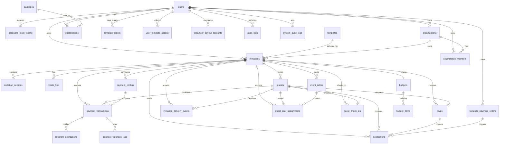

# Koupreng Database ERD

This document describes the Flyway-managed relational schema used by the backend.
Flyway migrations are the source of truth; Hibernate validates the schema and does not create it.

## Flyway Baseline

The development schema is consolidated into four migrations:

| Version | File | Scope |
| --- | --- | --- |
| V1 | `V1__core_schema.sql` | Auth, password reset, templates, invitations, sections, media, guests, RSVP, notifications, delivery events, and standalone events. |
| V2 | `V2__planning_and_operations_schema.sql` | Budgets, budget items, seating tables, seat assignments, guest check-ins, organizations, and organization membership. |
| V3 | `V3__payments_subscriptions_and_audit_schema.sql` | Packages, subscriptions, template orders, PayWay/template payment orders, template access, contribution payments, webhooks, Telegram notifications, payout accounts, and audit logs. |
| V4 | `V4__seed_initial_data.sql` | Initial subscription package seed rows only. |

The old V5+ history has been removed for a fresh development baseline. Existing local databases that already have the deleted migration versions in `flyway_schema_history` must be reset instead of repaired.

## Local Reset SQL

Use only for local development or disposable test databases:

```sql
DROP DATABASE IF EXISTS koupreng_invitation_dev;
CREATE DATABASE koupreng_invitation_dev
  CHARACTER SET utf8mb4
  COLLATE utf8mb4_unicode_ci;
```

Then point the backend at the recreated schema, for example:

```powershell
$env:DB_URL="jdbc:mysql://localhost:3306/koupreng_invitation_dev?useSSL=false&allowPublicKeyRetrieval=true&serverTimezone=UTC"
$env:JPA_DDL_AUTO="validate"
$env:FLYWAY_ENABLED="true"
$env:FLYWAY_VALIDATE_ON_MIGRATE="true"
```

Do not run the reset SQL against production or any database containing data that must be kept.

## Core Tables

| Table | Primary key | Main columns | Important foreign keys |
| --- | --- | --- | --- |
| `users` | `user_id` | `email`, `phone`, `password_hash`, `full_name`, `role`, `status`, `token_version`, `created_at`, `updated_at` | none |
| `password_reset_tokens` | `token_id` | `token_hash`, `expires_at`, `used_at`, `created_at` | `user_id -> users.user_id ON DELETE CASCADE` |
| `templates` | `template_id` | `code`, `name`, `category`, `description`, `thumbnail_url`, `preview_url`, `is_premium`, `price`, `currency`, `status`, `sort_order`, `created_at`, `updated_at` | none |
| `invitations` | `invitation_id` | `title`, `slug`, `event_type`, `event_date`, `event_time`, `venue_name`, `visibility`, `access_token`, `status`, `moderation_status`, `deleted`, `published_at`, `created_at`, `updated_at` | `user_id -> users.user_id ON DELETE CASCADE`, `template_id -> templates.template_id ON DELETE SET NULL`, `organization_id -> organizations.organization_id ON DELETE SET NULL` |
| `invitation_sections` | `section_id` | `section_key`, `section_title`, `content_json`, `sort_order`, `is_enabled` | `invitation_id -> invitations.invitation_id ON DELETE CASCADE` |
| `media_files` | `media_id` | `media_type`, `file_url`, `public_id`, `file_size`, `mime_type`, `original_filename`, `storage_provider`, `sort_order`, `is_cover`, `created_at`, `updated_at` | `invitation_id -> invitations.invitation_id ON DELETE CASCADE` |
| `guests` | `guest_id` | `guest_name`, `phone`, `email`, `guest_group`, `side_type`, `table_number`, `invite_token`, `qr_code_url`, `send_status`, `seat_count`, `note`, `created_at` | `invitation_id -> invitations.invitation_id ON DELETE CASCADE` |
| `rsvps` | `rsvp_id` | `response_status`, `attendee_count`, `message`, `responded_at` | `invitation_id -> invitations.invitation_id ON DELETE CASCADE`, `guest_id -> guests.guest_id ON DELETE SET NULL` |
| `notifications` | `notification_id` | `type`, `channel`, `status`, `title`, `message`, recipient fields, provider fields, `sent_at`, `delivered_at`, `read_at`, `created_at`, `updated_at` | `user_id -> users.user_id ON DELETE SET NULL`, `invitation_id -> invitations.invitation_id ON DELETE SET NULL`, `guest_id -> guests.guest_id ON DELETE SET NULL`, `rsvp_id -> rsvps.rsvp_id ON DELETE SET NULL`, `payment_order_id -> template_payment_orders.id ON DELETE SET NULL` |
| `invitation_delivery_events` | `delivery_event_id` | `event_type`, `channel`, `status`, `message`, `error_message`, `created_at` | `invitation_id -> invitations.invitation_id ON DELETE CASCADE`, `guest_id -> guests.guest_id ON DELETE SET NULL` |
| `events` | `id` | `event_name`, `template_type`, `groom`, `bride`, `event_date`, `eating_time`, `location`, `description`, `cover_image_url`, `status`, `deleted`, `created_at`, `updated_at`, `published_at` | none |

## Planning And Operations Tables

| Table | Primary key | Main columns | Important foreign keys |
| --- | --- | --- | --- |
| `budgets` | `budget_id` | `total_budget`, `notes`, `created_at`, `updated_at` | `invitation_id -> invitations.invitation_id ON DELETE CASCADE` |
| `budget_items` | `budget_item_id` | `category`, `item_name`, `estimated_cost`, `actual_cost`, `vendor_name`, `notes` | `budget_id -> budgets.budget_id ON DELETE CASCADE` |
| `event_tables` | `table_id` | `table_name`, `table_label`, `capacity`, `sort_order`, `notes`, `created_at`, `updated_at` | `invitation_id -> invitations.invitation_id ON DELETE CASCADE` |
| `guest_seat_assignments` | `assignment_id` | `seat_label`, `seat_count`, `notes`, `assigned_at` | `invitation_id -> invitations.invitation_id ON DELETE CASCADE`, `table_id -> event_tables.table_id ON DELETE CASCADE`, `guest_id -> guests.guest_id ON DELETE CASCADE` |
| `guest_check_ins` | `check_in_id` | `checked_in_at`, `checked_in_by`, `source`, `note` | `invitation_id -> invitations.invitation_id ON DELETE CASCADE`, `guest_id -> guests.guest_id ON DELETE CASCADE`, `checked_in_by -> users.user_id ON DELETE SET NULL` |
| `organizations` | `organization_id` | `name`, `slug`, `status`, `created_at`, `updated_at` | `owner_user_id -> users.user_id ON DELETE CASCADE` |
| `organization_members` | `member_id` | `email`, `role`, `status`, `invited_at`, `joined_at`, `created_at`, `updated_at` | `organization_id -> organizations.organization_id ON DELETE CASCADE`, `user_id -> users.user_id ON DELETE SET NULL` |

## Payments, Subscriptions, And Audit

| Table | Primary key | Main columns | Important foreign keys |
| --- | --- | --- | --- |
| `packages` | `package_id` | `code`, `package_name`, `description`, `price`, `currency`, `billing_interval`, limits, feature flags, `features_json`, `active`, `sort_order` | none |
| `subscriptions` | `subscription_id` | `order_code`, `start_date`, `end_date`, `amount`, `currency`, `payment_status`, `status`, `is_active`, `created_at`, `updated_at` | `user_id -> users.user_id ON DELETE CASCADE`, `package_id -> packages.package_id ON DELETE CASCADE` |
| `template_orders` | `id` | `order_code`, `template_id`, `template_name`, `package_name`, `amount`, `currency`, `payment_link`, `payment_note`, `status`, `payment_provider`, `created_at`, `updated_at` | `user_id -> users.user_id ON DELETE CASCADE` |
| `template_payment_orders` | `id` | `order_code`, `transaction_id`, `template_id`, `template_name`, `package_name`, `amount`, `paid_amount`, `currency`, `status`, `provider`, QR/PayWay fields, Telegram match fields, `paid_at`, `expires_at`, `created_at`, `updated_at` | `user_id -> users.user_id ON DELETE CASCADE` |
| `user_template_access` | `id` | `template_id`, `template_payment_order_id`, `access_type`, `active`, `created_at` | `user_id -> users.user_id ON DELETE CASCADE` |
| `payment_configs` | `payment_config_id` | `provider`, `payment_mode`, `is_enabled`, `is_fixed_amount`, amount limits, `currency`, Telegram settings, `created_at`, `updated_at` | `invitation_id -> invitations.invitation_id ON DELETE CASCADE` |
| `payment_transactions` | `payment_id` | `merchant_ref_no`, `payway_transaction_id`, payer fields, `amount`, `currency`, QR/link fields, `status`, callback JSON, `requested_at`, `paid_at`, `expired_at` | `invitation_id -> invitations.invitation_id ON DELETE CASCADE`, `guest_id -> guests.guest_id ON DELETE SET NULL`, `payment_config_id -> payment_configs.payment_config_id ON DELETE CASCADE` |
| `payment_webhook_logs` | `webhook_log_id` | `provider`, `event_type`, `request_headers`, `request_body`, `received_at`, `processed_status`, `processing_note` | `payment_id -> payment_transactions.payment_id ON DELETE SET NULL` |
| `telegram_notifications` | `telegram_notification_id` | `chat_id`, `message_text`, `status`, `sent_at`, `response_json`, `created_at` | `payment_id -> payment_transactions.payment_id ON DELETE CASCADE` |
| `organizer_payout_accounts` | `payout_account_id` | `provider`, `merchant_id`, `merchant_name`, `is_active`, `created_at`, `updated_at` | `user_id -> users.user_id ON DELETE CASCADE` |
| `audit_logs` | `log_id` | `action`, `target_type`, `target_id`, `details`, `created_at` | `user_id -> users.user_id ON DELETE SET NULL` |
| `system_audit_logs` | `log_id` | `actor_user_id`, `actor_email`, `action`, `resource_type`, `resource_id`, `description`, `ip_address`, `user_agent`, `metadata_json`, `created_at` | `actor_user_id -> users.user_id ON DELETE SET NULL` |

`user_template_access.template_payment_order_id` is indexed but intentionally has no database FK. The active entity uses `ConstraintMode.NO_CONSTRAINT`, and template purchase/access flows still support template IDs that are not enforced against `templates`.

## Relationship Notes

- One user owns many invitations, organizations, subscriptions, payment orders, template access grants, payout accounts, and audit records.
- One template can be selected by many invitations. Template purchase rows store `template_id` as a scalar for compatibility with static/fallback template catalogs.
- One organization can own many invitations through `invitations.organization_id`; deleting an organization sets that column to null.
- One invitation owns sections, media, guests, RSVP records, delivery events, budgets, seating tables, check-ins, payment configuration, and payment transactions.
- Guests can have one RSVP, one seat assignment, and one check-in row in the current schema.
- Packages are purchased through subscriptions. Template purchases use `template_payment_orders` and grant access through `user_template_access`.
- `events` is a standalone/general event module exposed by `/api/v1/events/**`; invitations remain the richer wedding-event model.
- Wedding gift tracking in the host UI is currently localStorage-backed. The backend has contribution infrastructure but no dedicated gift CRUD module.

## Optional Table Verification

| Candidate table | Exists now? | Current need |
| --- | --- | --- |
| `refresh_tokens` | No | Not needed for the current auth flow. `AuthResponse` returns only an access token, and logout invalidates existing tokens by incrementing `users.token_version`. Add this table only if long-lived refresh-token rotation/revocation is implemented. |
| `social_accounts` / `oauth_accounts` | No | Google and Telegram login exist, but `AuthService` currently upserts users by email and does not persist provider IDs from `ExternalAuthIdentity`. Add one of these tables if users must link multiple providers, preserve provider IDs, or support social login where email is missing/untrusted. |
| `payment_settings` | No | Not needed for the current backend. ABA/PayWay gateway settings come from Spring configuration/env (`app.payment.*`, `app.payment.payway.*`). Existing `payment_configs` is invitation-scoped setup, not global admin gateway configuration. |
| `template_categories` | No | Not needed while categories are controlled by the `TemplateCategory` enum and stored as `templates.category`. Add this table only if categories need admin-managed names, ordering, translations, or icons. |
| `template_assets` | No | Not needed for current template catalog records. `templates` stores `thumbnail_url` and `preview_url`; invitation-specific images/audio/videos are stored in `media_files`. Add this table if each template needs multiple managed demo images, audio tracks, videos, or downloadable asset variants. |
| `wedding_gifts` / `gift_contributions` | No | Not needed for the current frontend behavior because wedding gifts are localStorage-only. Add a dedicated table only after deciding whether gifts are manual host records, verified payment transactions, or both. |
| `email_verification_tokens` | No | Not needed because registration does not require email verification today. `password_reset_tokens` exists only for password reset. Add this table if account activation or email-change verification becomes required. |

## Mermaid ERD



## Important Indexes And Constraints

- `users.email`, `users.phone`, `templates.code`, `invitations.slug`, and `invitations.access_token` are unique.
- Invitation list/reporting indexes cover owner, deleted/status flags, template, organization, event date, and created-at sorting.
- `guests.invite_token` is unique; guest indexes support invitation-scoped token, email, phone, group/table/name, send-status, and viewed-count lookups.
- `rsvps.guest_id` is unique, enforcing one RSVP per invited guest.
- `budgets.invitation_id` is unique, enforcing one budget per invitation.
- `event_tables` has a unique `(invitation_id, table_name)` constraint.
- `guest_seat_assignments.guest_id` and `guest_check_ins.guest_id` are unique, enforcing one active seating/check-in record per guest.
- `organizations.slug` and `(organization_id, email)` in `organization_members` are unique.
- `packages.code`, `subscriptions.order_code`, `template_orders.order_code`, `template_payment_orders.order_code`, and `template_payment_orders.transaction_id` are unique payment/package references.
- Notification indexes support user inbox, unread counts, invitation status counts, duplicate reminder checks, and payment-order joins.
- Payment indexes support PayWay merchant reference, transaction ID, invitation/status reporting, webhook joins, and Telegram notification joins.
