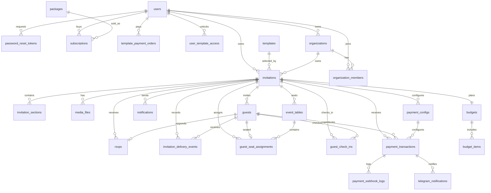

# Koupreng Database ERD

This document describes the Flyway-managed relational schema used by the backend.
Flyway migrations are the source of truth; Hibernate should validate the schema, not create it.

## Core Tables

| Table | Primary key | Main columns | Important foreign keys |
| --- | --- | --- | --- |
| `users` | `user_id` | `email`, `password_hash`, `full_name`, `role`, `status`, `created_at`, `updated_at` | none |
| `password_reset_tokens` | `token_id` | `token_hash`, `expires_at`, `used_at`, `created_at` | `user_id -> users.user_id` |
| `templates` | `template_id` | `code`, `name`, `category`, `description`, `thumbnail_url`, `preview_url`, `is_premium`, `price`, `currency`, `status`, `sort_order`, `created_at`, `updated_at` | none |
| `invitations` | `invitation_id` | `title`, `slug`, `event_type`, `event_date`, `event_time`, `venue_name`, `visibility`, `access_token`, `status`, `moderation_status`, `published_at`, `created_at`, `updated_at` | `user_id -> users.user_id`, `template_id -> templates.template_id`, `organization_id -> organizations.organization_id` |
| `invitation_sections` | `section_id` | `section_key`, `section_title`, `content_json`, `sort_order`, `is_enabled` | `invitation_id -> invitations.invitation_id` |
| `media_files` | `media_id` | `media_type`, `file_url`, `public_id`, `sort_order`, `is_cover`, `created_at` | `invitation_id -> invitations.invitation_id` |
| `guests` | `guest_id` | `guest_name`, `phone`, `email`, `guest_group`, `side_type`, `table_number`, `invite_token`, `send_status`, `created_at` | `invitation_id -> invitations.invitation_id` |
| `rsvps` | `rsvp_id` | `response_status`, `attendee_count`, `message`, `responded_at` | `invitation_id -> invitations.invitation_id`, `guest_id -> guests.guest_id` |
| `notifications` | `notification_id` | `channel`, `subject`, `message_body`, `scheduled_at`, `sent_at`, `status` | `invitation_id -> invitations.invitation_id`, `guest_id -> guests.guest_id` |
| `invitation_delivery_events` | `delivery_event_id` | `channel`, `recipient`, `status`, `provider_message_id`, `error_message`, `created_at` | `invitation_id -> invitations.invitation_id`, `guest_id -> guests.guest_id` |
| `events` | `id` | `event_name`, `template_type`, `groom`, `bride`, `event_date`, `eating_time`, `location`, `status`, `deleted`, `created_at`, `updated_at`, `published_at` | none |

## Planning And Operations Tables

| Table | Primary key | Main columns | Important foreign keys |
| --- | --- | --- | --- |
| `budgets` | `budget_id` | `total_budget`, `notes`, `created_at`, `updated_at` | `invitation_id -> invitations.invitation_id` |
| `budget_items` | `budget_item_id` | `category`, `item_name`, `estimated_cost`, `actual_cost`, `vendor_name`, `notes` | `budget_id -> budgets.budget_id` |
| `event_tables` | `table_id` | `table_name`, `table_label`, `capacity`, `sort_order`, `notes`, `created_at`, `updated_at` | `invitation_id -> invitations.invitation_id` |
| `guest_seat_assignments` | `assignment_id` | `seat_label`, `seat_count`, `notes`, `assigned_at` | `invitation_id -> invitations.invitation_id`, `table_id -> event_tables.table_id`, `guest_id -> guests.guest_id` |
| `guest_check_ins` | `check_in_id` | `check_in_token`, `checked_in_at`, `checked_in_by`, `note` | `invitation_id -> invitations.invitation_id`, `guest_id -> guests.guest_id` |

## Organization Tables

| Table | Primary key | Main columns | Important foreign keys |
| --- | --- | --- | --- |
| `organizations` | `organization_id` | `name`, `slug`, `status`, `created_at`, `updated_at` | `owner_user_id -> users.user_id` |
| `organization_members` | `member_id` | `email`, `role`, `status`, `invited_at`, `joined_at`, `created_at`, `updated_at` | `organization_id -> organizations.organization_id`, `user_id -> users.user_id` |

## Subscription And Payment Tables

| Table | Primary key | Main columns | Important foreign keys |
| --- | --- | --- | --- |
| `packages` | `package_id` | `code`, `package_name`, `description`, `price`, `currency`, `billing_interval`, `duration_days`, `max_invitations`, `max_guests`, `features_json`, `active`, `sort_order` | none |
| `subscriptions` | `subscription_id` | `order_code`, `start_date`, `end_date`, `amount`, `currency`, `payment_status`, `status`, `is_active`, `created_at`, `updated_at` | `user_id -> users.user_id`, `package_id -> packages.package_id` |
| `template_orders` | `order_id` | `order_code`, `template_id`, `template_name`, `amount`, `currency`, `status`, `created_at` | `user_id -> users.user_id` |
| `template_payment_orders` | `order_id` | `order_code`, `transaction_id`, `template_id`, `template_name`, `package_name`, `amount`, `paid_amount`, `currency`, `status`, `provider`, `payment_link`, `paid_at`, `expires_at`, `created_at` | `user_id -> users.user_id` |
| `user_template_access` | `access_id` | `template_id`, `access_type`, `active`, `granted_at`, `expires_at` | `user_id -> users.user_id` |
| `payment_configs` | `payment_config_id` | `provider`, `payment_mode`, `is_enabled`, `fixed_amount`, `currency`, `telegram_notify_enabled`, `created_at`, `updated_at` | `invitation_id -> invitations.invitation_id` |
| `payment_transactions` | `payment_id` | `merchant_ref_no`, `payway_transaction_id`, `amount`, `currency`, `qr_payload`, `payment_link`, `status`, `requested_at`, `paid_at`, `expired_at` | `invitation_id -> invitations.invitation_id`, `guest_id -> guests.guest_id`, `payment_config_id -> payment_configs.payment_config_id` |
| `payment_webhook_logs` | `webhook_log_id` | `provider`, `event_type`, `request_headers`, `request_body`, `received_at`, `processed_status` | `payment_id -> payment_transactions.payment_id` |
| `telegram_notifications` | `telegram_notification_id` | `chat_id`, `message_text`, `status`, `sent_at`, `response_json`, `created_at` | `payment_id -> payment_transactions.payment_id` |
| `organizer_payout_accounts` | `payout_account_id` | `provider`, `merchant_id`, `merchant_name`, `is_active`, `created_at`, `updated_at` | `user_id -> users.user_id` |

## Audit Tables

| Table | Primary key | Main columns | Important foreign keys |
| --- | --- | --- | --- |
| `audit_logs` | `log_id` | `action`, `target_type`, `target_id`, `details`, `created_at` | `user_id -> users.user_id` |
| `system_audit_logs` | `audit_log_id` | `actor_user_id`, `actor_email`, `action`, `target_type`, `target_id`, `description`, `ip_address`, `created_at` | none |

## Relationship Notes

- One user owns many invitations.
- One template can be used by many invitations.
- One organization can own many invitations through `invitations.organization_id`.
- One invitation owns guests, media, sections, budget, seating tables, check-ins, delivery events, notifications, and RSVP records.
- Guests can have one RSVP and one seat assignment in the current schema.
- Budgets are one-to-one with invitations. Budget items belong to a budget.
- Packages are purchased through subscriptions. Template purchases use `template_payment_orders` and grant access through `user_template_access`.
- `events` is a legacy/general event module exposed by `/api/v1/events/**`. It is now backed by a Flyway table, but invitations remain the richer wedding-event model.

## Mermaid ERD

## Important Indexes And Constraints

- `invitations.slug` is unique for public invitation URLs.
- `invitations.access_token` is unique for private access links.
- `templates.code` is unique for public template lookup.
- `guests.invite_token` is unique for guest-specific RSVP/check-in links.
- `rsvps.guest_id` is unique after the RSVP hardening migration, enforcing one RSVP per invited guest.
- `budgets.invitation_id` is unique, enforcing one budget per invitation.
- `event_tables` has a unique `(invitation_id, table_name)` constraint.
- `guest_seat_assignments.guest_id` is unique, enforcing one table assignment per guest.
- `organizations.slug` is unique.
- `organization_members` has a unique `(organization_id, email)` constraint.
- `packages.code` is unique.
- `subscriptions.order_code`, `template_orders.order_code`, and `template_payment_orders.order_code` are unique payment references.
