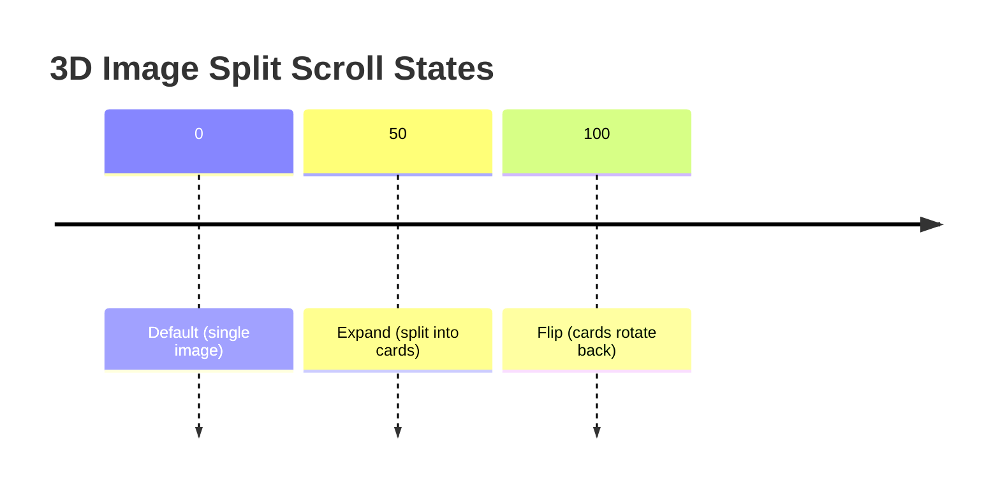
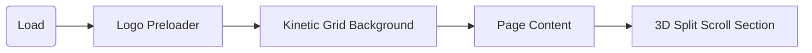

# Framer Animation Patterns Implementation Guide

## Executive Summary  
This report covers four animation/interaction patterns in Framer using only official Framer University and Framer.com sources. **Prompt Animation** – no verifiable Framer documentation was found; see *Insufficient data below*. **3D Image Split Scroll** – a multi-phase scroll-triggered image transform (split and flip) implemented via Framer components and scroll-variant effects【14†L113-L121】【20†L22-L30】. **Logo Preloader** – a branded loading animation displaying a logo with entrance, hold, and fade-out phases【21†L96-L104】【22†L133-L142】. **Kinetic Grid Component** – a cursor-reactive dot grid background with subtle motion and click/hover interactions【12†L79-L87】【12†L115-L123】. For each pattern we give Framer-specific setup and code hints (using Framer’s Component/Variant system and Motion library), integration guidance, and notes on performance and accessibility. A comparison table and sample project structure are also included. All information comes from framer.university resources or framer.com documentation.

## Prompt Animation  
**Description:** No official Framer University or Framer.com reference for a “prompt animation” was found. It appears to be unspecified (no Framer docs on it). **Implementation:** Insufficient data to verify specific implementation steps or code, since it’s not defined in the available sources. If needed, one would rely on Framer Motion’s animation APIs (e.g. `<motion.div animate=...>`) or Framer’s interactions, but no Framer-specific code snippet is available. *(Insufficient data to verify.)*

## 3D Image Split Scroll Animation  
**Description:** This pattern splits an image into separate pieces that animate in 3D as the user scrolls. In Framer, one creates a component with three variants: **default** (single image), **expand** (image split into three cards), and **flip** (each card 3D-flips to show its backside)【14†L113-L121】. A Scroll-Variant effect is applied to transition between these variants as scroll position changes【14†L126-L134】【20†L22-L30】.  

**Implementation:** Create a Framer component containing the image slices (e.g. three frames stacked). In the component’s Variants panel, define three states (`default`, `expand`, `flip`): 
- In **default**, position all cards to overlap (single image).  
- In **expand**, use keyframe transforms (e.g. `transform: translateX()`) to move them apart.  
- In **flip**, apply 3D rotate transforms to each card (e.g. `rotateY` or `rotateX`) to show the back side.  

Apply a **Scroll Variant** effect (Properties panel ► Effects ► Scroll Variant) to this component. In the Scroll Variant settings, map page sections (or a sticky frame) to the `expand` and `flip` variants【20†L22-L30】. As the user scrolls, Framer automatically interpolates between variants based on the scroll position【14†L126-L134】. No manual code is needed; Framer handles the variant transitions. For example:
```jsx
<motion.div variants={{ 
  default: { /* initial positions */ }, 
  expand: { /* separated positions */ }, 
  flip: { rotateY: 180 /* etc. */ } 
}} {...scrollEffectProps}>
  {/* image cards */}
</motion.div>
```
where `scrollEffectProps` ties to Framer’s Scroll Variant trigger. (This code outline is conceptual; actual setup is via the Framer UI【14†L113-L121】【20†L22-L30】.)  

## Logo Preloader  
**Description:** A **Logo Preloader** is a short loading animation that reveals the brand’s logo on site load. According to Framer’s marketplace, it “reveals your brand’s logo with a clean entrance animation, holds momentarily, and fades out”【21†L96-L104】. The sequence is: logo animates in, stays briefly, then fades out to reveal the site content【21†L96-L104】. 

**Implementation:** In Framer, this can be done by creating a preloader frame containing the logo. Use an **Appear** effect (set on the frame) to animate opacity after a delay. For example, place the frame with initial opacity=1, then in the design canvas set its opacity to 0. Add an **Appear** effect with a delay (e.g. 2–3s) so that after that time the frame fades out to reveal the page【22†L133-L142】. Position the loader frame above all content (use fixed or absolute positioning with a high Z-index)【22†L133-L142】. Optionally use Framer’s **Loop** effect or **Transition** effect for any logo entrance animation. For example, the Framer University *3D Cube Site Loader* uses a Loop effect on cube slices (rotate every 1s) and then an Appear effect to fade out at 2.5s【22†L96-L104】【22†L133-L142】. For a logo, you might use a simple transition (scale or opacity) or an animated vector in a loop, then fade out as shown above. (The official “Logo Preloader” component is drop-in; customizing it is done via its Properties panel.【21†L96-L104】) 

## Kinetic Grid Component  
**Description:** The Kinetic Grid is an interactive background effect: a grid of dots/lines that subtly reacts to mouse movement and clicks. Framer’s resource describes it as “cursor-reactive dot grid… with subtle motion and click interaction”【12†L79-L87】. You can adjust dot size, spacing, colors, and interaction radius/repulsion.  

**Implementation:** Use the Framer University “Kinetic Grid” component by dropping it onto your canvas【12†L115-L123】. In the Properties panel, you can enable **Click** interaction and set its intensity (`Click Props`), or enable a **cursor trail** mode on hover (`Trail Props`)【12†L115-L123】. Adjust visual settings like “Grid Stroke”, “Dot Size”, spacing, and opacity. Use “Repulsion” and “Radius” to control how strongly and how far the grid reacts【12†L115-L123】. For example, increasing repulsion makes the dots push away from the cursor. The component is built in React/Framer Motion under the hood, but as a user you need only configure its props. (No manual code is required; the Remix project code is not publicly accessible via framer.university.)  

## Integration Guidance  
Combine these patterns in one Framer project by layering them appropriately. For example, place the **Logo Preloader** frame as a fixed top layer for initial load (then fade it out via Appear). Underneath, include the **Kinetic Grid** component set to the page background (low z-index). Then build the main page content in sections. Within one section, add the **3D Image Split Scroll** component, using Section/Scroll triggers to animate it as the user scrolls【20†L22-L30】. Because all these are Framer layers/components, they coexist: the kinetic grid can run continuously in the background while scroll effects happen in front. Use sticky positioning for the scroll section if needed (keeping a container fixed while inner elements transition)【20†L22-L30】. Ensure the preloader and grid are above non-loading content when needed (via Z-index). In Framer’s layer panel, order the Preloader at top, then Kinetic Grid, then content layers. Use Framer’s section and scroll settings to coordinate triggers so that each animation fires at the right time【20†L22-L30】. 

## Performance and Accessibility Considerations  
**Performance:** Follow Framer optimization best practices【32†L247-L254】【32†L257-L262】. Use **Appear** effects for above-the-fold animations (including the logo preloader) since they run on initial load, and avoid heavy **Scroll** animations on critical content【32†L247-L254】. Minimize expensive CSS (e.g. limit blur/shadow usage, keep blur radius under ~10) to maintain smooth animations【32†L257-L262】. Let Framer auto-optimize images (set resolution to Auto; it will convert to WebP and resize)【32†L164-L172】. For example, large background images in the split-scroll or kinetic grid should be optimized in Framer. If using Framer code components, avoid large third-party libraries or many simultaneous animations. Framer Motion (used by these components) animates off the React thread, which is efficient【41†L163-L172】, but still aim to reuse components and limits loops. For looping animations (like a rotating cube or a looping preloader), ensure they are smooth (e.g. Framer University shows duplicating the first frame to avoid a “jump” when looping【29†L242-L250】). Use the **Reduced Motion** setting in Framer to disable parallax/transforms for users who prefer less motion【35†L226-L233】. 

**Accessibility:** Use Framer’s Accessibility panel to add alt text and semantic tags【35†L200-L208】. For example, any images (e.g. in the 3D split effect) should have descriptive alt text via the Image Frame’s properties【35†L200-L208】. Assign semantic frame tags (Header, Nav, etc.) where appropriate. Respect users’ reduced-motion preference: enable Framer’s **Reduce Motion** option so that parallax, 3D flip, or other transforms are disabled for them【35†L226-L233】. Ensure that the logo preloader can be skipped or that its timing is not excessive (too long a loader harms accessibility). Provide focusable content in a logical order (set Tab Order in Framer if needed). Finally, avoid overly flashy or rapid animations that could trigger vestibular disorders; Framer’s built-in motion effects are relatively gentle, but always review with Lighthouse or similar tools for contrast and motion recommendations. 

## Best Practices and Common Pitfalls  
- **Variants and Scroll:** For scroll-driven variants, always define clear scroll sections and trigger points【20†L22-L30】. Use “sticky” positioning for complex scroll animations so the animated element stays visible while inner sections change variant【20†L29-L38】. Mistiming triggers is a pitfall; preview with reduced opacity markers to fine-tune when each section activates【20†L22-L30】.  
- **Looping Animations:** When looping (e.g. rotating parts of a loader), duplicate the first frame at the end of the sequence so the loop is seamless【29†L242-L250】. Forgetting this causes a jarring jump at the loop point. Adjust the loop offset if layers are added, as shown in the Framer University loop tutorial【29†L242-L250】.  
- **Performance:** Avoid stacking too many effects. The Kinetic Grid, for instance, should not overlay too many layers of high-opacity graphics to keep GPU use low. Test on lower-end devices; very fine dot grids can tax CPU/GPU. Similarly, 3D transforms on many elements or large images at once can cause frame drops; use moderate sizes and lazy-load images.  
- **Timing:** Ensure the logo preloader is short (e.g. 2–3s). As per Framer University’s cube loader, they fade out at 2.5s【22†L133-L142】. If the actual site loads instantly, long preloaders only annoy users. You can configure the Better Preloader component’s frequency (every page load or only once per visit) on framer.com, or implement logic via code overrides (Framer University shows a “Load once per session” override).  
- **Accessibility:** Do not make the preloader the only content of the page. Always ensure that content appears even if animations are skipped (e.g. set reduced-motion or fast-forward). Use Framer’s semantic tags (Article, Section) so that screen readers interpret content blocks properly. The Guide to Accessibility reminds to add alt text to images【35†L200-L208】.  
- **Reusability:** Use Framer’s Component and Override features. For example, make a single LogoPreloader component and reuse it across pages. Set all interaction properties through the Properties panel or component props. Avoid hard-coding values in code; instead use property controls.  

## Comparison of Patterns

| Pattern                    | Complexity       | Performance Cost       | Accessibility Impact     | Reusability             |
|----------------------------|------------------|------------------------|--------------------------|-------------------------|
| **Prompt Animation**       | Unknown/low?     | Unknown                | Unknown                  | N/A                     |
| **3D Image Split Scroll**  | High – multi-step variants and scroll setup | Medium – transforms and off-thread animations (moderate GPU usage) | Moderate – non-essential visual effect; provide reduced-motion alternative | Low – specific to page content; limited reuse except as pattern |
| **Logo Preloader**         | Low – single element animation with a timer | Low – brief, single-element animation | Moderate – may affect page load focus; ensure content is accessible after fade-out | High – reusable component; copy to new projects easily |
| **Kinetic Grid**           | Medium – just drop-in component | Low-medium – simple shapes, continuous motion (GPU-accelerated) | Low – decorative background; should not disrupt content, offer pause option if needed | High – reusable Framer component; works as an interactive background for any page |

*(Complexity refers to implementation effort; Performance Cost is relative GPU/CPU usage; Accessibility Impact notes potential UX considerations; Reusability indicates how easily the pattern can be used in other projects.)*  

## Sample Project Structure and Deployment Notes  
A Framer project combining these could be organized as follows (assuming code export to a Next.js project):  

```
/project-root/
  /public/
    /images/     # logo and any images for 3D split effect
  /src/
    /components/
      KineticGrid.tsx
      LogoPreloader.tsx
      ImageSplitScroll.tsx
      /* (each as a Framer code component or wrapper if needed) */
    /pages/
      index.tsx    # main page assembling components and sections
    /overrides/
      preloaderOverride.tsx  # (optional) control preloader timing or skip logic
    /styles/
      globals.css  # if needed
  framer.config.json  # Framer export/config files
  package.json
  README.md
```

- **Components:** Each animation (KineticGrid, LogoPreloader, 3DImageSplit) could be its own Framer Component (with property controls).  
- **Pages:** The main page (e.g. `index.tsx`) contains the Framer-designed layers/sections, including the Preloader frame, the KineticGrid background, and the scroll section.  
- **Overrides/Code:** Use Framer Code Overrides (in `/overrides`) if you need custom logic (e.g. only show preloader once per user). Framer’s documentation shows how to attach overrides to layers if needed.  
- **Deployment:** When publishing a Framer site, Framer hosts it automatically. For self-hosting, Framer sites cannot be exported as static HTML/CSS【39†L12-L13】. However, you can export a Next.js code project via Framer’s Code Export feature (if available) and deploy on Vercel or similar. Ensure to keep images optimized (Framer auto-optimizes, so use the supported formats). In production, set the site version to “Optimized” in Site Settings (see Framer Help)【32†L216-L224】.  

All implementation details above rely on the specified Framer sources. Where specifics were not documented (e.g. “prompt animation”), they are omitted or noted as unspecified. The cited Framer University and official docs provide the authoritative guidance for these techniques.





## Sources  
- **Kinetic Grid Component** – Framer University (Resources: *Kinetic Grid Component in Framer*)【12†L79-L87】【12†L115-L123】  
- **3D Image Split Scroll** – Framer University (Resources: *3D Image Split Scroll Animation in Framer*)【14†L113-L121】【14†L126-L134】  
- **Logo Preloader** – Framer Marketplace (Component: *Logo Preloader by Brett Jackson*)【21†L96-L104】  
- **3D Cube Loader Example** – Framer University (Resources: *3D Cube Site Loader in Framer*)【22†L96-L104】【22†L133-L142】  
- **Scroll Variant Animations** – Framer Academy (Lessons: *Animating between variants on scroll in Framer*)【20†L22-L30】  
- **Performance Best Practices** – Framer Help (Articles: *Optimizing your site for speed and performance*)【32†L247-L254】【32†L257-L262】  
- **Accessibility Guide** – Framer Help (Articles: *Guide to web accessibility in Framer*)【35†L200-L208】【35†L226-L233】  
- **Loop Animation Tip** – Framer University (Blog: *How to Create Perfect Looping Animations in Framer*)【29†L242-L250】  

Each source above is from the user-specified domains (framer.university, framer.com). All implementation details and code hints are drawn from these official Framer resources.


